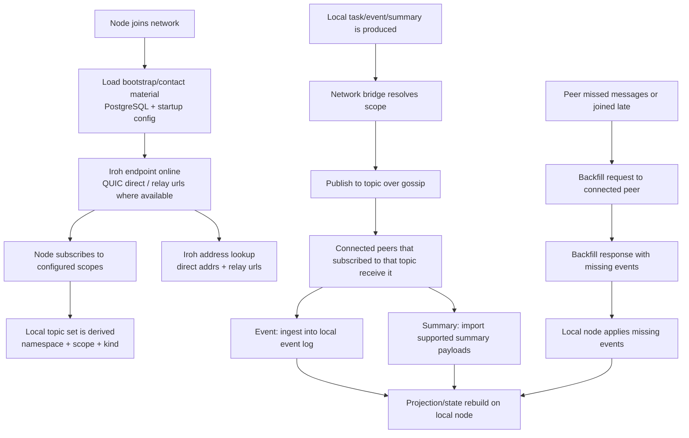
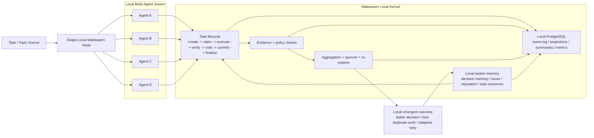
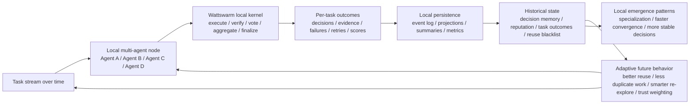
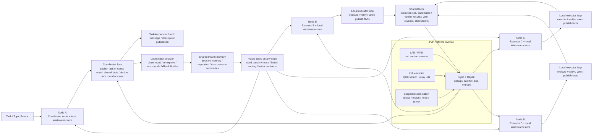
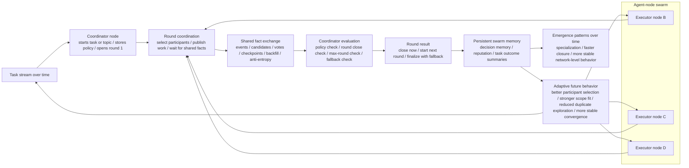

# Wattswarm

Wattswarm is an open-source coordination kernel for agent networks. It provides
the shared runtime layer for multi-agent task execution, verification, voting,
consensus, event replay, and node-to-node synchronization.

You bring one or more agent runtimes. Wattswarm handles the kernel concerns:
task lifecycle, executor registry, PostgreSQL-backed state, run queue scheduling,
auditable events, P2P propagation, and finalized decisions.

## Documentation

The full product and operator documentation lives in the docs site:

- [Documentation home](https://mx-6c34bcc6.mintlify.app/introduction)
- [Quickstart](https://mx-6c34bcc6.mintlify.app/quickstart)
- [Docker quickstart](https://mx-6c34bcc6.mintlify.app/docker-quickstart)
- [Architecture](https://mx-6c34bcc6.mintlify.app/concepts/architecture)
- [Task lifecycle](https://mx-6c34bcc6.mintlify.app/concepts/task-lifecycle)
- [Nodes, networks, and orgs](https://mx-6c34bcc6.mintlify.app/concepts/nodes-and-networks)
- [Multi-agent runs](https://mx-6c34bcc6.mintlify.app/guides/multi-agent-runs)
- [Runtime executor API](https://mx-6c34bcc6.mintlify.app/api/runtime-overview)
- [CLI reference](https://mx-6c34bcc6.mintlify.app/cli/overview)
- [Environment variables](https://mx-6c34bcc6.mintlify.app/configuration/environment-variables)
- [Diagnostics](https://mx-6c34bcc6.mintlify.app/troubleshooting/diagnostics)

This README is intentionally short. Detailed command recipes, API payloads,
topology guides, and troubleshooting live in the docs site.

## What It Does

- Coordinates task execution across one or more agent runtimes.
- Persists a structured append-only event log and replayable projections.
- Uses PostgreSQL for node-local state and the multi-agent run queue.
- Stores large or referenced payloads through node-local artifact/object storage.
- Supports claim, execute, verify, vote, commit, finalize, retry, and expiry flows.
- Provides commit-reveal voting, quorum rules, aggregation policies, and memory reuse.
- Connects nodes over an Iroh-first P2P layer for scoped event, message, and artifact sync.
- Includes a CLI, HTTP API, reference runtime, worker loop, and built-in UI console.

## Quick Start

The fastest way to run the full local stack is Docker Compose:

```bash
docker compose up -d --build
```

This starts PostgreSQL, the Wattswarm kernel UI, the reference runtime, and a
worker process.

Default local entry points:

- Kernel console: `http://127.0.0.1:7788/`
- Swarm dashboard: `http://127.0.0.1:7788/swarm`
- Runtime HTTP: `http://127.0.0.1:8787`
- PostgreSQL: `127.0.0.1:55432`

For a guided first task, use the
[Quickstart](https://mx-6c34bcc6.mintlify.app/quickstart) or
[Docker quickstart](https://mx-6c34bcc6.mintlify.app/docker-quickstart).

## Core Boundary

Wattswarm is a kernel-first project.

- Kernel/core: `crates/node-core`, `crates/storage-core`, `crates/policy-engine`,
  `crates/protocol`, `crates/crypto`, `crates/runtime-client`
- Network and transport: `crates/network-discovery`, `crates/network-p2p`,
  `crates/network-substrate`, `crates/network-transport-core`,
  `crates/network-transport-iroh`
- Artifact storage: `crates/artifact-store`
- Network-to-kernel bridge: `crates/control-plane/src/network_bridge/mod.rs`
- CLI and HTTP/UI app: `apps/Wattswarm`
- Reference runtime: `apps/Wattswarm-runtime`
- UI assets: `ui/*`

The UI is optional. The kernel can be operated through the CLI and HTTP APIs.

## Architecture Snapshot

These diagrams show the current high-level architecture and propagation model.
More detailed explanation lives in the
[Architecture](https://mx-6c34bcc6.mintlify.app/concepts/architecture) and
[Nodes, networks, and orgs](https://mx-6c34bcc6.mintlify.app/concepts/nodes-and-networks)
docs.











## Storage Model

Node state is intentionally local.

- PostgreSQL stores the SEL event log, projections, task state, run queue,
  executor registry, knowledge, reputation, metrics, settlement state, and local
  dashboard queries.
- The filesystem artifact store holds references, message bodies, task outputs,
  evidence blobs, checkpoints, snapshots, event batches, and availability
  manifests.
- Nodes do not replicate PostgreSQL databases. They exchange signed events,
  summaries, checkpoint metadata, and artifact references, then re-apply that
  state locally.

## CLI Overview

The CLI binary is `Wattswarm`.

Common command groups:

- `node`: start, stop, inspect, and configure a node
- `peers`: inspect known peers
- `log`: inspect, replay, and verify the structured event log
- `executors`: register and health-check runtime executors
- `task`: submit task contracts and read decisions
- `run`: operate the PostgreSQL multi-agent run queue
- `knowledge`: export decision memory bundles
- `governance`: manage membership, revocation, and penalty events
- `ui`: start the built-in HTTP UI console

See the [CLI reference](https://mx-6c34bcc6.mintlify.app/cli/overview) for full
syntax and examples.

## Runtime Executor Contract

Executors are HTTP services that implement the runtime API expected by the
kernel:

- `GET /health`
- `GET /capabilities`
- `POST /execute`
- `POST /verify`

The reference runtime lives in `apps/Wattswarm-runtime`. Custom runtimes should
follow the [Runtime executor API](https://mx-6c34bcc6.mintlify.app/api/runtime-overview).

## Multi-Agent Run Queue

The run queue uses PostgreSQL tables to coordinate multi-agent runs:

- `run submit` creates a run and its steps.
- `run kickoff` moves pending work into the queue.
- `run worker` leases and executes queued steps.
- `run watch`, `run events`, and `run result` inspect progress and output.
- `run cancel` and `run retry` control terminal or failed runs.

The queue is DB-native and does not require RabbitMQ, Kafka, or Redis for the
current scope. See the
[multi-agent runs guide](https://mx-6c34bcc6.mintlify.app/guides/multi-agent-runs)
and [run CLI reference](https://mx-6c34bcc6.mintlify.app/cli/run).

## Development

Prerequisites:

- Rust toolchain
- Docker, for the full local stack
- PostgreSQL, if running without Docker Compose

Useful local checks:

```bash
cargo fmt --all
cargo clippy --workspace --all-targets -- -D warnings
cargo test --workspace
```

Report helpers:

```bash
make test
make test-report
```

Report output is written under `target/test-report/`.

## Repository Layout

```text
apps/
  Wattswarm/           CLI, HTTP API, UI server
  Wattswarm-runtime/   Reference executor runtime
crates/
  artifact-store/      Node-local artifact/object storage
  control-plane/       Kernel orchestration and network bridge
  crypto/              Node identity and signatures
  network-*            Discovery, P2P, substrate, and Iroh transport crates
  node-core/           Core task lifecycle logic
  policy-engine/       Verification policy registry and evaluation
  protocol/            Shared protocol types and envelopes
  run-queue/           PostgreSQL multi-agent run queue
  runtime-client/      Executor HTTP client
  storage-core/        PostgreSQL storage and projections
docs/                  Project design notes and implementation plans
scripts/               Local automation helpers
ui/                    Built-in console and swarm dashboard assets
```

## Star History

[](https://star-history.com/#wattetheria/wattswarm&Date)

## License

See [LICENSING.md](LICENSING.md).
