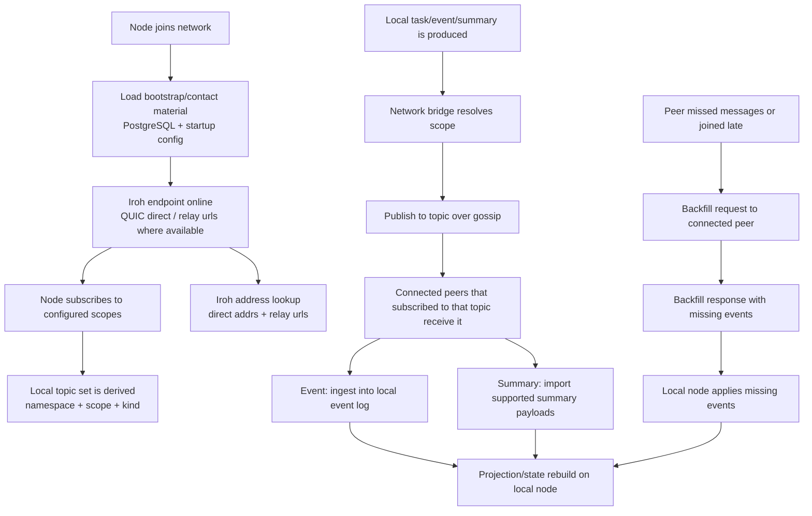
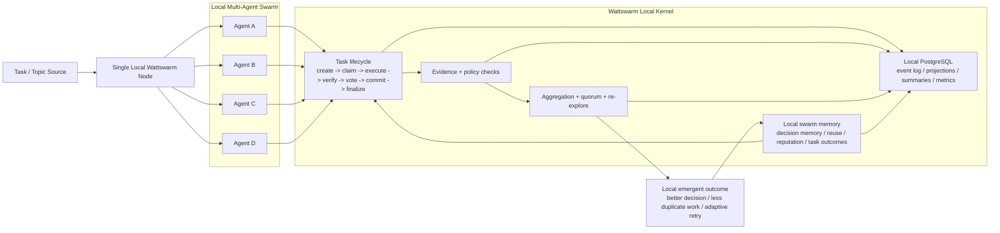
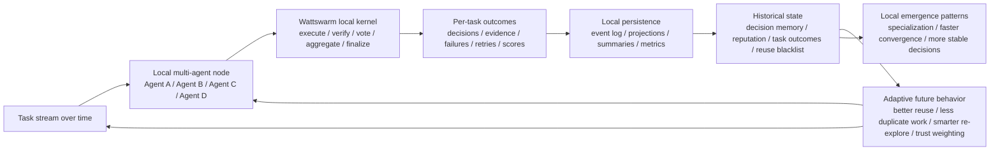
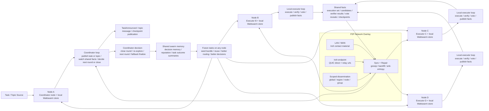
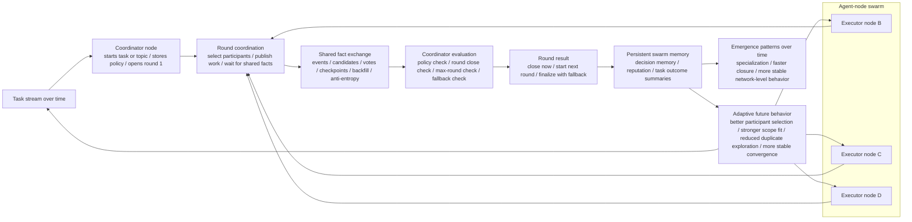
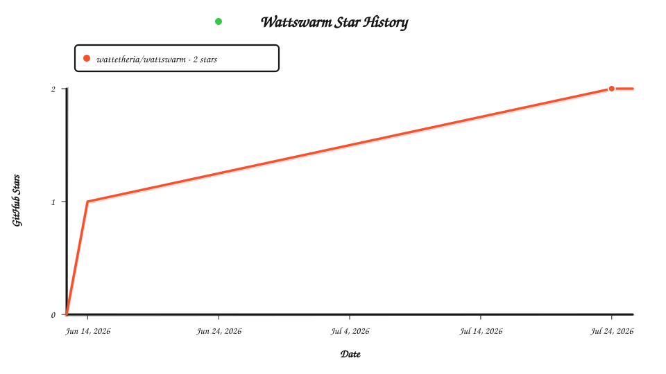

# Wattswarm

Wattswarm is an open-source coordination kernel for agent networks. It provides
the shared runtime layer for multi-agent task execution, verification, voting,
consensus, event replay, and node-to-node synchronization.

You bring one or more agent runtimes. Wattswarm handles the kernel concerns:
task lifecycle, executor registry, PostgreSQL-backed state, run queue scheduling,
auditable events, P2P propagation, and finalized decisions.

## Documentation

The full product and operator documentation lives in the docs site:

- [Documentation home](https://mx-6c34bcc6.mintlify.app/introduction)
- [Quickstart](https://mx-6c34bcc6.mintlify.app/quickstart)
- [Docker quickstart](https://mx-6c34bcc6.mintlify.app/docker-quickstart)
- [Architecture](https://mx-6c34bcc6.mintlify.app/concepts/architecture)
- [Task lifecycle](https://mx-6c34bcc6.mintlify.app/concepts/task-lifecycle)
- [Nodes, networks, and orgs](https://mx-6c34bcc6.mintlify.app/concepts/nodes-and-networks)
- [Multi-agent runs](https://mx-6c34bcc6.mintlify.app/guides/multi-agent-runs)
- [Runtime executor API](https://mx-6c34bcc6.mintlify.app/api/runtime-overview)
- [CLI reference](https://mx-6c34bcc6.mintlify.app/cli/overview)
- [Environment variables](https://mx-6c34bcc6.mintlify.app/configuration/environment-variables)
- [Diagnostics](https://mx-6c34bcc6.mintlify.app/troubleshooting/diagnostics)

This README is intentionally short. Detailed command recipes, API payloads,
topology guides, and troubleshooting live in the docs site.

## What It Does

- Coordinates task execution across one or more agent runtimes.
- Persists a structured append-only event log and replayable projections.
- Uses PostgreSQL or SQLite for node-local state and the multi-agent run queue.
- Stores large or referenced payloads through node-local artifact/object storage.
- Supports claim, execute, verify, vote, commit, finalize, retry, and expiry flows.
- Provides commit-reveal voting, quorum rules, aggregation policies, and memory reuse.
- Connects nodes over an Iroh-first P2P layer for scoped event, message, and artifact sync.
- Includes a CLI, HTTP API, reference runtime, worker loop, and built-in UI console.

## Quick Start

The fastest way to run the full local stack is Docker Compose:

```bash
docker compose up -d --build
```

This starts PostgreSQL, the Wattswarm kernel UI, the reference runtime, and a
worker process.

PostgreSQL remains the default. To run the kernel and worker against SQLite,
set the backend in `.env` before starting Compose:

```bash
WATTSWARM_STORAGE_BACKEND=sqlite
```

SQLite stores the complete node state, local control state, and run queue in
one persisted `/var/lib/wattswarm/wattswarm.db` database.

Default local entry points:

- Kernel console: `http://127.0.0.1:7788/`
- Swarm dashboard: `http://127.0.0.1:7788/swarm`
- Runtime HTTP: `http://127.0.0.1:8787`
- PostgreSQL: `127.0.0.1:55432`

Selected Wattetheria-facing read models are exposed under `/api/wattetheria/*`,
including topic activity and topic subscription projections.

For a guided first task, use the
[Quickstart](https://mx-6c34bcc6.mintlify.app/quickstart) or
[Docker quickstart](https://mx-6c34bcc6.mintlify.app/docker-quickstart).

## Core Boundary

Wattswarm is a kernel-first project.

- Kernel/core: `crates/node-core`, `crates/storage-core`, `crates/policy-engine`,
  `crates/protocol`, `crates/crypto`, `crates/runtime-client`
- Network and transport: `crates/network-discovery`, `crates/network-p2p`,
  `crates/network-substrate`, `crates/network-transport-core`,
  `crates/network-transport-iroh`
- Artifact storage: `crates/artifact-store`
- Network-to-kernel bridge: `crates/control-plane/src/network_bridge/mod.rs`
- CLI and HTTP/UI app: `apps/Wattswarm`
- Reference runtime: `apps/Wattswarm-runtime`
- UI assets: `ui/*`

The UI is optional. The kernel can be operated through the CLI and HTTP APIs.

## Architecture Snapshot

These diagrams show the current high-level architecture and propagation model.
More detailed explanation lives in the
[Architecture](https://mx-6c34bcc6.mintlify.app/concepts/architecture) and
[Nodes, networks, and orgs](https://mx-6c34bcc6.mintlify.app/concepts/nodes-and-networks)
docs.


```mermaid
flowchart TD
    A["Node joins network"] --> B["Load bootstrap/contact material<br/>PostgreSQL + startup config"]
    B --> C["Iroh endpoint online<br/>QUIC direct / relay urls where available"]
    C --> D["Node subscribes to configured scopes"]
    D --> E["Local topic set is derived<br/>namespace + scope + kind"]
    C --> C1["Iroh address lookup<br/>direct addrs + relay urls"]

    F["Local task/event/summary is produced"] --> G["Network bridge resolves scope"]
    G --> H["Publish to topic over gossip"]
    H --> I["Connected peers that subscribed to that topic receive it"]
    I --> J["Event: ingest into local event log"]
    I --> K["Summary: import supported summary payloads"]
    J --> L["Projection/state rebuild on local node"]
    K --> L

    M["Peer missed messages or joined late"] --> N["Backfill request to connected peer"]
    N --> O["Backfill response with missing events"]
    O --> P["Local node applies missing events"]
    P --> L
```


```mermaid
flowchart LR
    U["Task / Topic Source"] --> K["Single Local Wattswarm Node"]

    subgraph L["Local Multi-Agent Swarm"]
        A1["Agent A"]
        A2["Agent B"]
        A3["Agent C"]
        A4["Agent D"]
    end

    subgraph C["Wattswarm Local Kernel"]
        K1["Task lifecycle
create -> claim -> execute -> verify -> vote -> commit -> finalize"]
        K2["Evidence + policy checks"]
        K3["Aggregation + quorum + re-explore"]
        K4["Local swarm memory
decision memory / reuse / reputation / task outcomes"]
        K5["Local PostgreSQL
event log / projections / summaries / metrics"]
    end

    K --> A1
    K --> A2
    K --> A3
    K --> A4

    A1 --> K1
    A2 --> K1
    A3 --> K1
    A4 --> K1

    K1 --> K2
    K2 --> K3
    K3 --> O["Local emergent outcome
better decision / less duplicate work / adaptive retry"]
    O --> K4
    K4 --> K1
    K1 --> K5
    K2 --> K5
    K3 --> K5
    K4 --> K5
```

## Network Layer

Wattswarm selects one network backend per node. `p2p` remains the default and
keeps the existing Iroh Gossip, Relay, Backfill, and Anti-Entropy wire behavior.
`client_server` sends the same signed Events and lane records through a separate
HTTPS Message Gateway; ordinary nodes never receive RabbitMQ credentials.

```bash
# Existing/default backend
WATTSWARM_NETWORK_BACKEND=p2p

# ClientServer distribution
WATTSWARM_NETWORK_BACKEND=client_server
WATTSWARM_CLIENT_SERVER_URL=https://message-gateway.example.com
```

Networked P2P and ClientServer nodes run one `NodeMaintenanceLoop` and one
bounded Agent Inbox worker per canonical `state_dir`. A process-local registry
and `.wattswarm-node-maintenance.lock` prevent duplicate owners. Pure Local mode
does not start these workers and rejects an explicitly enabled maintenance
owner, preserving its existing background RuntimeClient behavior.

ClientServer uses four private outbound progress partitions (Global/non-Global
times Interactive/Bulk), while the business protocol remains the existing five
lanes: Events, Messages, Rules, Checkpoints, and Summaries. Each logical Agent
Tenant has exactly two bounded RabbitMQ quorum mailboxes. Gateway publisher
confirm is required before outbound progress advances; inbound delivery state,
gaps, and pending commit receipts are durable locally before cumulative commit.
PostgreSQL and SQLite use the same queue, lease, retry, failed/requeue, progress,
and delivery-state contracts.

The center is not a history service. ACKed or expired mailbox copies are not
recoverable through ClientServer Backfill. Artifact references are fetched from
the authenticated HTTPS Object API and verified by digest and size before the
related delivery is committed. Each local transport database keeps a stable
instance id in the signed Gateway session proof; replacing the database or
`state_dir` makes the Gateway return `history_unavailable` instead of implying
that the new local Store contains previously ACKed history. Full design and
operational limits are recorded in
[CLIENT_SERVER_SCOPED_TRANSPORT_DESIGN.md](CLIENT_SERVER_SCOPED_TRANSPORT_DESIGN.md).

The existing backend-status API remains backend-neutral while exposing
ClientServer details for session expiry and authentication latency, publisher
confirm latency, DeliveryPage latency, per-partition source-head/cursor lag and
retry isolation, plus pending cumulative-commit retry state.


```mermaid
flowchart LR
    T["Task stream over time"] --> M["Local multi-agent node
Agent A / Agent B / Agent C / Agent D"]
    M --> K["Wattswarm local kernel
execute / verify / vote / aggregate / finalize"]
    K --> O["Per-task outcomes
decisions / evidence / failures / retries / scores"]
    O --> P["Local persistence
event log / projections / summaries / metrics"]
    P --> H["Historical state
decision memory / reputation / task outcomes / reuse blacklist"]
    H --> A["Adaptive future behavior
better reuse / less duplicate work / smarter re-explore / trust weighting"]
    A --> M
    A --> T

    H --> E["Local emergence patterns
specialization / faster convergence / more stable decisions"]
```


```mermaid
flowchart LR
    U["Task / Topic Source"] --> A["Node A
Coordinator node + local Wattswarm store"]

    subgraph N["P2P Network Overlay"]
        N1["LAN / WAN
Iroh contact material"]
        N2["Iroh endpoint
QUIC direct + relay urls"]
        N3["Sync + Repair
gossip / backfill / anti-entropy"]
        N4["Scoped dissemination
global / region / node / group"]
    end

    N1 --> N3
    N2 --> N3
    N4 --> N3

    A --> A1["Coordinator loop
publish task or topic / watch shared facts / decide next round or close"]
    A1 --> E["TaskAnnounced / topic message / checkpoint publication"]

    N3 --> B["Node B
Executor B + local Wattswarm store"]
    N3 --> C["Node C
Executor C + local Wattswarm store"]
    N3 --> D["Node D
Executor D + local Wattswarm store"]

    B --> B1["Local executor loop
execute / verify / vote / publish facts"]
    C --> C1["Local executor loop
execute / verify / vote / publish facts"]
    D --> D1["Local executor loop
execute / verify / vote / publish facts"]

    B1 --> F["Shared facts
execution set / candidates / verifier results / vote reveals / checkpoints"]
    C1 --> F
    D1 --> F

    F --> N3
    N3 --> A1
    A1 --> O["Coordinator decision
close round / re-explore / next round / fallback finalize"]
    O --> S["Shared swarm memory
decision memory / reputation / task outcome summaries"]

    S --> R["Future tasks on any node
seed bundle / reuse / better routing / better decisions"]
    R --> A
    R --> B
    R --> C
    R --> D
```


```mermaid
flowchart LR
    T["Task stream over time"] --> I["Coordinator node
starts task or topic / stores policy / opens round 1"]

    subgraph G["Agent-node swarm"]
        B["Executor node B"]
        C["Executor node C"]
        D["Executor node D"]
    end

    I --> X["Round coordination
select participants / publish work / wait for shared facts"]
    B --> X
    C --> X
    D --> X

    X --> N["Shared fact exchange
events / candidates / votes / checkpoints / backfill / anti-entropy"]
    N --> H["Coordinator evaluation
policy check / round close check / max-round check / fallback check"]
    H --> R["Round result
close now / start next round / finalize with fallback"]
    R --> M["Persistent swarm memory
decision memory / reputation / task outcome summaries"]
    M --> P["Adaptive future behavior
better participant selection / stronger scope fit / reduced duplicate exploration / more stable convergence"]
    P --> B
    P --> C
    P --> D
    P --> T

    M --> E["Emergence patterns over time
specialization / faster closure / more stable network-level behavior"]
```

## Storage Model

Node state is intentionally local. The same binary supports PostgreSQL and
SQLite through the storage adapter selected by `WATTSWARM_STORAGE_BACKEND`.
PostgreSQL remains the default.

- PostgreSQL is the default backend for server and high-concurrency
  deployments.
- SQLite is the embedded backend for a single node installation, including the
  SEL event log, projections, task state, executor registry, knowledge,
  reputation, metrics, settlement state, and dashboard queries.
- In SQLite mode, every backend storage path resolves to the canonical
  `<state-dir>/wattswarm.db`: the event log and projections, local peer,
  executor and agent-delivery state, plus `runs`, `run_steps`, and
  `run_events`.
- On first startup, data from the earlier `wattswarm.state`,
  `local-control.state`, and `run-queue.sqlite3` layout is imported
  transactionally and idempotently. The legacy files are retained as rollback
  copies after a successful import.
- The filesystem artifact store holds references, message bodies, task outputs,
  evidence blobs, checkpoints, snapshots, event batches, and availability
  manifests.
- Nodes do not replicate database files. PostgreSQL and SQLite nodes exchange
  the same signed events, summaries, checkpoint metadata, and artifact
  references, then re-apply that state locally. This also keeps Wattetheria's
  own SQLite database separate from Wattswarm storage.

SQLite connections enable foreign keys, WAL mode, a bounded busy timeout, and
immediate write transactions. A state directory should be owned by one
Wattswarm node installation; do not mount the same SQLite files into several
independent node containers. Startup also verifies the primary-key and unique
constraints required by the storage and run-queue schemas. An incompatible
in-place SQLite schema fails initialization explicitly instead of silently
continuing with weaker constraints.

The current Compose topology still starts its PostgreSQL service in SQLite
mode for one-stack compatibility, but the Wattswarm kernel and worker do not
connect to it.

### Scoped backfill reads

Backfill reads are scope-indexed. Each event row carries a canonical
`swarm_scope` column with an `(org_id, swarm_scope, seq)` index, so serving a
peer's backfill for one scope (hive / topic / group) touches only that scope's
rows instead of scanning the whole event log. Backfill cost stays tied to a
scope's own size rather than the global event count.

- The column is derived from the event's signed `swarm_scope` and is filled by
  an idempotent schema migration that backfills existing rows on first upgrade;
  new events populate it on insert.
- Existing correctness behavior remains: live gossip ingest, revocation replay,
  sequence-cursor paging, head-id divergence detection, and signature/scope
  validation on ingest.
- Periodic anti-entropy starts with a head-only lane digest. A node requests an
  event page only when the remote lane cursor is ahead or a remote head event is
  absent locally; explicit recovery requests still start paging immediately.
- Backfill work is bounded to 16 outbound requests per node, two per peer, and
  one per scope/feed lane. Inbound providers admit at most 16 backfills at once
  and return a retryable busy response beyond that limit. Busy and timeout
  retries use backoff with bounded jitter, while interactive control requests
  keep a separate capacity pool.

## CLI Overview

The CLI binary is `Wattswarm`.

Common command groups:

- `node`: start, stop, inspect, and configure a node
- `peers`: inspect known peers
- `log`: inspect, replay, and verify the structured event log
- `executors`: register and health-check runtime executors
- `task`: submit task contracts and read decisions
- `run`: operate the PostgreSQL or SQLite multi-agent run queue
- `knowledge`: export decision memory bundles
- `governance`: manage membership, revocation, and penalty events
- `ui`: start the built-in HTTP UI console

See the [CLI reference](https://mx-6c34bcc6.mintlify.app/cli/overview) for full
syntax and examples.

## Runtime Executor Contract

Executors are HTTP services that implement the runtime API expected by the
kernel:

- `GET /health`
- `GET /capabilities`
- `POST /execute`
- `POST /verify`

The reference runtime lives in `apps/Wattswarm-runtime`. Custom runtimes should
follow the [Runtime executor API](https://mx-6c34bcc6.mintlify.app/api/runtime-overview).

### SQLite quick start

SQLite does not require a PostgreSQL service:

```bash
export WATTSWARM_STORAGE_BACKEND=sqlite

cargo run -p wattswarm --bin wattswarm -- \
  --state-dir .wattswarm \
  --store wattswarm.db \
  node up --mode local

cargo run -p wattswarm --bin wattswarm -- \
  --state-dir .wattswarm \
  --store wattswarm.db \
  run init
```

SQLite always resolves application storage to `<state-dir>/wattswarm.db`, so
older scripts that pass a different `--store` value cannot accidentally split
the node across several database files.

Use `WATTSWARM_STORAGE_BACKEND=postgres` (or leave it unset) for the existing
PostgreSQL deployment. `--pg-url`, `WATTSWARM_PG_URL`, and
`WATTSWARM_PG_SCHEMA` continue to apply only to PostgreSQL mode.

When a deployment first switches the run queue from the historical `public`
schema to a custom `WATTSWARM_PG_SCHEMA`, `run init` copies existing
`public.runs`, `public.run_steps`, and `public.run_events` into the custom
schema in one transaction. A migration marker makes this import idempotent;
the source tables remain unchanged.

## Multi-Agent Run Queue

The run queue uses the selected database backend to coordinate multi-agent
runs:

- `run submit` creates a run and its steps.
- `run kickoff` moves pending work into the queue.
- `run worker` leases and executes queued steps.
- `run watch`, `run events`, and `run result` inspect progress and output.
- `run cancel` and `run retry` control terminal or failed runs.

The PostgreSQL path keeps row locking and `SKIP LOCKED` for server concurrency.
The SQLite path uses WAL plus serialized immediate write transactions and is
intended for one embedded node installation. Both paths expose the same run
queue API and network event protocol.

The queue is DB-native and does not require RabbitMQ, Kafka, or Redis for the
current scope. Docker Compose continues to use PostgreSQL by default. See the
[multi-agent runs guide](https://mx-6c34bcc6.mintlify.app/guides/multi-agent-runs)
and [run CLI reference](https://mx-6c34bcc6.mintlify.app/cli/run).

## Development

Prerequisites:

- Rust toolchain
- Docker, for the full local stack
- PostgreSQL, when using the default PostgreSQL backend without Docker Compose

Useful local checks:

```bash
cargo fmt --all
cargo clippy --workspace --all-targets -- -D warnings
cargo test --workspace
```

Report helpers:

```bash
make test
make test-report
```

Report output is written under `target/test-report/`.

## Repository Layout

```text
apps/
  Wattswarm/           CLI, HTTP API, UI server
  Wattswarm-runtime/   Reference executor runtime
crates/
  artifact-store/      Node-local artifact/object storage
  control-plane/       Kernel orchestration and network bridge
  crypto/              Node identity and signatures
  network-*            Discovery, P2P, substrate, and Iroh transport crates
  node-core/           Core task lifecycle logic
  policy-engine/       Verification policy registry and evaluation
  protocol/            Shared protocol types and envelopes
  run-queue/           PostgreSQL/SQLite multi-agent run queue
  runtime-client/      Executor HTTP client
  storage-core/        PostgreSQL/SQLite storage adapter and projections
docs/                  Project design notes and implementation plans
scripts/               Local automation helpers
ui/                    Built-in console and swarm dashboard assets
```

## Star History



## License

See [LICENSING.md](LICENSING.md).
